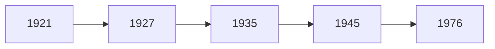

[TOC]

# 第一章 毛泽东思想及其历史地位

最早出现：43年7月5日，王稼祥《中国共产党与中国民族解放的道路》

毛思想三部分

- 新民主主义革命（包含战争部分）
- 社会主义革命
- 社会主义建设

## 分析理论四步法

- 历史条件
  - 国内
  - 国际
- 形成过程（重大历史事件）
- 主要内容
- 意义（历史地位）
  - 理论
    - 继承
    - 创新
  - 实践——作用

时间线

